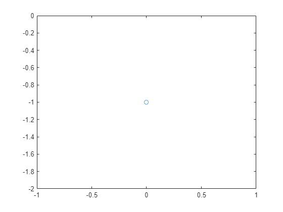
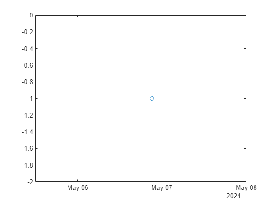

```matlab
ld = readtimetable("allSolvers.csv");

% Get rid of bad entries
ix = isinf(ld.score);
ld(ix,:) = []
```
| |t|result|computeTime|score|author|commit|
|:--:|:--:|:--:|:--:|:--:|:--:|:--:|
|1|06-May-2024 21:06:17|-1|0|-5|'gulley'|'75300ae7d493637041100036e5d3688fab0669b4'|

```matlab
plot(ld.computeTime,ld.result,"-o")
```



```matlab
plot(ld.t,ld.result,"-o")
```


