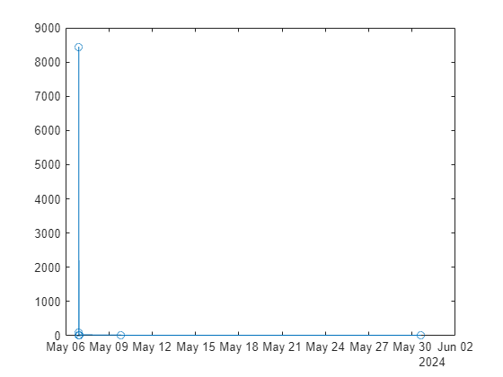

```matlab
ld = readtimetable("allSolvers.csv");

% Get rid of bad entries
ix = isinf(ld.score);
ld(ix,:) = []
```
| |t|result|computeTime|score|commit|
|:--:|:--:|:--:|:--:|:--:|:--:|
|1|02-May-2024 21:43:39|172.0743|0.0118|861.5540|'foo'|
|2|03-May-2024 16:37:51|103.1756|0.1964|535.5132|'foo'|
|3|03-May-2024 16:52:19|49.7914|0.2193|270.8836|'foo'|
|4|03-May-2024 21:06:41|26.0168|0.2941|159.4943|'foo'|
|5|03-May-2024 21:38:06|8.6216|0.3813|81.2332|'c4d4f514a6d582d08d8a35b0b32c2a66d40ea3c4'|

```matlab
plot(ld.computeTime,ld.result,"-o")
```


```matlab
plot(ld.t,ld.result,"-o")
```


